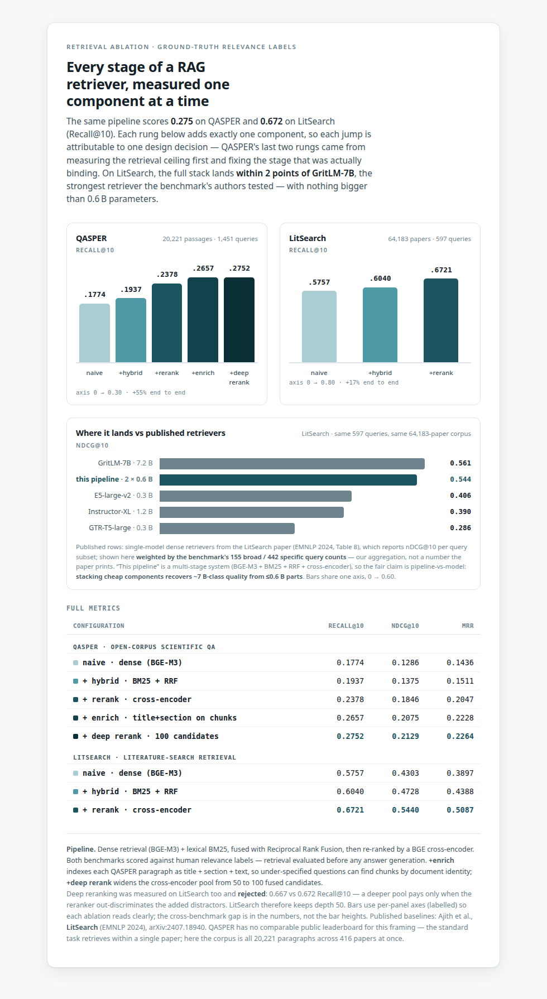

# adaptive-multimodal-rag

A retrieval pipeline, measured one component at a time — dense → +hybrid (BM25 + RRF) →
+rerank (cross-encoder) → +enrich → +deep rerank — evaluated against QASPER and LitSearch
with human relevance labels, and checked against published state of the art.

**Status: M1 (text retrieval) is built and measured.** The project's eventual scope is
*adaptive* multimodal RAG — a per-query router choosing between text and screenshot-native
visual retrieval over scientific papers — but that router and the visual retrieval arm
(M2–M4) are designed, not yet implemented. See [Roadmap](#roadmap) for exactly where the
line is.

<picture>
  <source media="(prefers-color-scheme: dark)" srcset="docs/figures/ablation-dark.png">
  
</picture>

## Headline results

| | QASPER (Recall@10) | LitSearch (Recall@10) |
| --- | --- | --- |
| naive — dense (BGE-M3) | 0.177 | 0.576 |
| + hybrid — BM25 + RRF | 0.194 | 0.604 |
| + rerank — cross-encoder | 0.238 | **0.672** |
| + enrich — title+section on chunks | 0.266 | — |
| + deep rerank — 100 candidates | **0.275** | (0.667, rejected — see below) |

Every rung is a single, isolated change, so every jump is attributable to one design
decision — full numbers in [`results/`](results/).

**Against published state of the art:** the LitSearch authors (EMNLP 2024) benchmarked
retrieval models on the exact same 597 queries and 64,183-paper corpus. On nDCG@10, this
pipeline lands within ~2 points of **GritLM-7B** (a 7B-parameter embedder) and ahead of
every other retriever they tested by 13+ points — with nothing in this stack bigger than
0.6B parameters:

| Model | Params | nDCG@10 |
| --- | --- | --- |
| GritLM-7B | 7.2B | 0.561 |
| **this pipeline** | **2×0.6B** | **0.544** |
| E5-large-v2 | 0.3B | 0.406 |
| Instructor-XL | 1.2B | 0.390 |
| GTR-T5-large | 0.3B | 0.286 |

Source: Ajith et al., *LitSearch: A Retrieval Benchmark for Scientific Literature Search*,
EMNLP 2024 ([arXiv:2407.18940](https://arxiv.org/abs/2407.18940)), Table 8. Their numbers
are per query-subset; the figure above weights them by the benchmark's 155 broad / 442
specific query counts — that weighting is this project's aggregation, not the paper's.
Full caveats and the exact weighting math are in
[`results/linkedin_post.md`](results/linkedin_post.md#sota-comparison--receipts-for-answering-comments).

## How the last two QASPER rungs were found

The `+rerank` stage can only promote what's in its candidate pool, so
[`scripts/diagnose_ceiling.py`](scripts/diagnose_ceiling.py) measures that pool's recall
*before* touching the reranker:

| | fused R@10 | fused R@50 | fused R@100 |
| --- | --- | --- | --- |
| QASPER | 0.194 | 0.303 | 0.347 |
| LitSearch | 0.604 | 0.780 | 0.815 |

QASPER's pool held only ~35% of the evidence even at depth 100 — first-stage recall, not
the reranker, was the binding constraint. The fix was giving each indexed chunk its
document identity (`+enrich`: title + section + paragraph, instead of a bare paragraph),
which is why it outguns widening the rerank pool alone. Widening the pool *was* tried on
LitSearch too, and made it very slightly worse (0.672 → 0.667) — a deeper pool only pays
off when the reranker can out-discriminate the extra distractors it introduces, so
LitSearch keeps `--rerank-depth 50`. Full design rationale:
[`docs/specs/2026-07-13-m1-pipeline-improvements-design.md`](docs/specs/2026-07-13-m1-pipeline-improvements-design.md).

## Architecture

```
query ──┬─→ dense (BGE-M3)   ──┐
        └─→ sparse (BM25)    ──┴─→ RRF fuse ──→ cross-encoder rerank ──→ top-k
```

A `Retriever` protocol returning a uniform `Hit` type lets dense, sparse, fused, and
reranked stages compose without any consumer caring which is which
([`src/amrag/types.py`](src/amrag/types.py)). Retrieval is evaluated in isolation, before
any answer generation — an answer metric on top of unmeasured retrieval is undiagnosable.
Official metrics (QASPER's Answer-F1/Evidence-F1) are vendored from the upstream evaluator,
never reimplemented, so scores stay comparable to published numbers.

## Repository layout

```
src/amrag/
  corpus/     QASPER + LitSearch adapters (documents, queries, qrels)
  index/      BM25, dense (BGE-M3) retrievers; persistent embedding cache
  retrieve/   RRF fusion, cross-encoder reranking, HyDE query expansion
  eval/       IR metrics (recall/precision/nDCG/MRR), the ablation ladder
  generate/   DeepSeek client + grounded prompt (for M1's answer-generation slice)
scripts/
  run_m1.py            the ablation ladder driver (--dataset, --enrich, --rerank-depth, ...)
  diagnose_ceiling.py  fused-pool recall ceiling, run before optimizing a stage
results/      every measured configuration, as committed markdown tables
docs/specs/   design docs (the full multimodal research design lives here)
docs/plans/   implementation plans
vendor/       the official QASPER evaluator, vendored verbatim
```

## Running it

```bash
uv pip install -e ".[dev]"        # or: pip install -e ".[dev]"
source scripts/env.sh             # pins all downloaded weights/data under _cache/
python -m pytest                  # fast tests only; slow (real-weights) tests are marked

python scripts/run_m1.py --dataset qasper --enrich --rerank-depth 100
python scripts/run_m1.py --dataset litsearch
python scripts/diagnose_ceiling.py --dataset qasper
```

`--device cpu` works everywhere the tests do; GPU is only needed for full-corpus runs at
reasonable wall-clock time. Every non-default flag lands in the output filename
(`results/m1_{dataset}_{flags}.md`), so no results table is ambiguous about its config.

## Roadmap

**Built (M1):** everything above — the text retrieval pipeline and its evaluation.

**Designed, not built (M2–M4):** the project's actual thesis, laid out in
[`docs/specs/2026-07-10-multimodal-rag-design.md`](docs/specs/2026-07-10-multimodal-rag-design.md) —
screenshot-native visual retrieval (ColPali-family) over paper figures/tables that a
text-only pipeline discards, a per-query router deciding text vs. visual retrieval, and
grounded generation with citations across both. `src/amrag/types.py` already carries a
`Modality = Literal["text", "visual"]` field on every `Hit` for exactly this reason — but
no code path sets it to `"visual"` yet; M1 is a pure text pipeline. M2's oracle labels are
a deliberate gate before M2–M4 get written, so their scope isn't fixed prematurely.

## Datasets & benchmarks

- **[QASPER](https://huggingface.co/datasets/allenai/qasper)** — 20,221 evidence paragraphs
  / 1,451 questions, evaluated open-corpus (search all paragraphs across all 416 papers,
  not just the one paper a question was written about — harder than, and not comparable
  to, the standard within-paper QASPER task).
- **[LitSearch](https://github.com/princeton-nlp/LitSearch)** — 64,183 papers (titles +
  abstracts) / 597 literature-search queries, evaluated exactly as the benchmark's authors
  specify, which is what makes the SOTA comparison above apples-to-apples.
